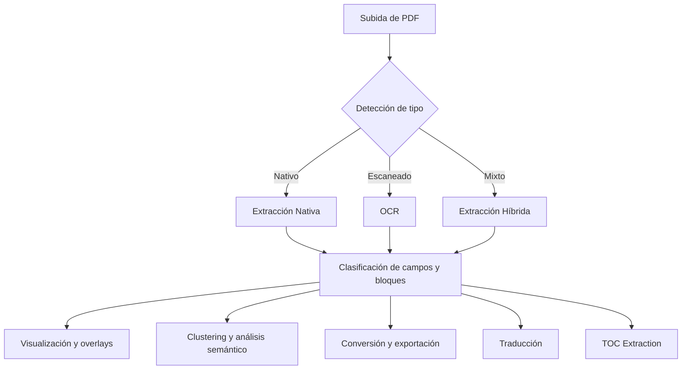

# PDF Analysis Dashboard

## Descripción General

Este proyecto es una plataforma avanzada para la extracción, análisis y visualización de información en documentos PDF. Utiliza técnicas de procesamiento nativo, OCR, clustering semántico y una interfaz interactiva basada en Dash para facilitar la exploración y explotación de documentos complejos.

---


## Tabla de Contenidos
- [Instalación](#instalación)
- [Estructura del Proyecto](#estructura-del-proyecto)
- [Descripción de Carpetas y Módulos](#descripción-de-carpetas-y-módulos)
- [Motores Integrados](#motores-integrados)
- [Guía de Uso de la Interfaz](#guía-de-uso-de-la-interfaz)
- [Funcionalidad de Cada Ventana y Recuadro](#funcionalidad-de-cada-ventana-y-recuadro)
- [Ejemplos Visuales y Diagramas](#ejemplos-visuales-y-diagramas)
- [Notas y Consejos](#notas-y-consejos)

---

## Instalación

1. **Clona el repositorio:**
   ```bash
   git clone <repo-url>
   cd pdf-main
   ```
2. **Crea un entorno virtual y activa:**
   ```bash
   conda create -n pdfenv python=3.10
   conda activate pdfenv
   ```
3. **Instala dependencias:**
   ```bash
   pip install -r requirements.txt
   ```
4. **Asegúrate de tener instalados los motores externos:**
   - [Poppler](https://poppler.freedesktop.org/)
   - [Tesseract OCR](https://github.com/tesseract-ocr/tesseract)
   - (Opcional) Instala fuentes y datos de idioma adicionales para Tesseract.

5. **Ejecuta la aplicación:**
   ```bash
   python -m src.app.app
   ```

---

## Estructura del Proyecto

```
pdf-main/
├── assets/                # Archivos estáticos (CSS)
├── data/                  # Archivos de datos, caché, outputs
├── engines/               # Motores externos (poppler, tesseract)
├── src/
│   ├── app/               # Lógica de la app Dash (layout, callbacks)
│   ├── config/            # Configuración y rutas
│   ├── conversion/        # Conversión de formatos
│   ├── core/              # Contexto, pipeline, controlador
│   ├── detection/         # Detección de tipo de PDF
│   ├── extraction/        # Extracción nativa, OCR, híbrida
│   ├── ingest/            # Subida y almacenamiento de archivos
│   ├── layout/            # Segmentación y orden de lectura
│   ├── metadata/          # Persistencia y metadatos
│   ├── semantic/          # Clustering, embeddings, análisis semántico
│   ├── translation/       # Traducción automática
│   ├── utils/             # Utilidades generales
│   └── visualization/     # Overlays y visualización
├── tests/                 # Pruebas unitarias
├── requirements.txt       # Dependencias
├── README.md              # (Este archivo)
```

---

## Descripción de Carpetas y Módulos

- **assets/**: Hojas de estilo CSS para personalizar la interfaz.
- **data/**: Almacena archivos subidos, caché de procesamiento, resultados y datos crudos.
- **engines/**: Motores externos requeridos (Poppler para PDF, Tesseract para OCR).
- **src/app/**: Código principal de la app Dash: layout, callbacks, integración de módulos.
- **src/config/**: Configuración de rutas y parámetros globales.
- **src/conversion/**: Conversión de PDF a otros formatos (Markdown, HTML).
- **src/core/**: Lógica central, contexto de documento, pipeline de procesamiento y controlador general.
- **src/detection/**: Detección automática del tipo de PDF (nativo, escaneado, mixto).
- **src/extraction/**: Extracción de texto y campos clave (nativo, OCR, híbrido), normalización de bounding boxes.
- **src/ingest/**: Subida de archivos y almacenamiento seguro.
- **src/layout/**: Segmentación de página, orden de lectura, agrupación de bloques.
- **src/metadata/**: Persistencia de resultados, almacenamiento de metadatos y documentos procesados.
- **src/semantic/**: Generación de embeddings, clustering (UMAP, PCA, HDBSCAN, KMeans), análisis semántico.
- **src/translation/**: Traducción automática de textos extraídos.
- **src/utils/**: Utilidades para manejo de imágenes, geometría, etc.
- **src/visualization/**: Generación de overlays visuales sobre las páginas PDF.
- **tests/**: Pruebas unitarias para cada módulo.

---

## Motores Integrados

- **Poppler**: Motor para renderizar y extraer contenido de PDFs nativos.
- **Tesseract OCR**: Motor de reconocimiento óptico de caracteres para PDFs escaneados o imágenes.
- **UMAP**: Reducción dimensional no lineal para visualización y clustering.
- **HDBSCAN**: Clustering robusto para datos de densidad variable.
- **KMeans**: Clustering clásico para agrupaciones bien separadas.
- **PCA**: Reducción dimensional lineal.

---

## Guía de Uso de la Interfaz

La aplicación se compone de varias ventanas, pestañas y recuadros interactivos. A continuación se explica la funcionalidad de cada uno:

### 1. Subida y Selección de Documentos
- **Upload PDF**: Permite subir uno o varios archivos PDF.
- **Dropdown de archivos**: Selecciona el documento a analizar.
- **Botón de análisis**: Inicia el procesamiento del documento seleccionado.

### 2. Resumen y Búsqueda Avanzada
- **Resumen del Documento**: Muestra metadatos clave (nombre, tipo, páginas, campos extraídos, embedding, sentimiento).
- **Búsqueda avanzada**: Permite buscar campos clave o bloques por palabra clave y tipo.
- **Tablas de resultados**: Listan los campos y bloques encontrados, con contexto y sentimiento.

### 3. Visualización y Overlays
- **PDF Preview**: Muestra la página procesada con overlays de bounding boxes.
- **Botón de descarga de visualización**: Permite descargar la imagen con overlays.

### 4. OCR y Conversión
- **OCR Output**: Ejecuta OCR sobre el documento, muestra la imagen y la confianza promedio.
- **Conversión a Markdown/HTML**: Descarga el documento extraído en otros formatos.

### 5. Clustering y Análisis Semántico
- **Pestaña de Clustering**: Permite agrupar documentos según su contenido semántico.
    - **Controles de reducción y clustering**: Selecciona el método de reducción (PCA, UMAP) y clustering (KMeans, HDBSCAN).
    - **Botones de información**: Explican cada método de reducción y clustering.
    - **Gráfico interactivo**: Visualiza los documentos agrupados en 2D.
    - **Panel de métricas**: Muestra número de clusters, ruido, tamaño de cada cluster.
    - **Panel de exploración**: Permite seleccionar un cluster y ver detalles (IDs, distancia al centroide, lista de documentos).
    - **Panel de ayuda**: Explica cómo interpretar el clustering y los controles.

### 6. Traducción y TOC
- **Traducción**: Traduce los primeros bloques del documento al idioma seleccionado.
- **TOC Extraction**: Extrae y muestra la tabla de contenidos jerárquica del PDF.

---

## Funcionalidad de Cada Ventana y Recuadro

- **Ventana principal**: Navegación entre pestañas (análisis, clustering, OCR, conversión, traducción, TOC).
- **Recuadro de resumen**: Información clave del documento y estado del procesamiento.
- **Tablas de resultados**: Permiten explorar y filtrar los campos y bloques extraídos.
- **Gráfico de clustering**: Visualización interactiva de agrupaciones, con tooltips y selección de clusters.
- **Panel de detalles de cluster**: Estadísticas y lista de documentos de cada cluster.
- **Botones de información**: Explican cada método de reducción y clustering con descripciones claras.
- **Panel de ayuda**: Consejos y guía rápida para interpretar los resultados.

---


---

## Ejemplos Visuales y Diagramas

### Diagrama de Flujo General



### Ejemplo Visual de la Interfaz


*La imagen muestra la ventana principal con resumen, búsqueda avanzada, visualización de overlays y pestaña de clustering.*

### Diagrama de Componentes Principales

```mermaid
graph LR
   UI[Interfaz Dash]
   Controller[Controller / Pipeline]
   Extractors[Extractores (Nativo, OCR, Híbrido)]
   Clustering[Clustering (UMAP, PCA, KMeans, HDBSCAN)]
   Overlay[Visualización / Overlays]
   Storage[Almacenamiento / DocumentStore]
   Engines[Poppler / Tesseract]
   UI --> Controller
   Controller --> Extractors
   Controller --> Clustering
   Controller --> Overlay
   Controller --> Storage
   Extractors --> Engines
   Overlay --> Storage
   Clustering --> Storage
```

### Ejemplo de Panel de Clustering


*Visualización de clusters con selección interactiva y panel de detalles.*


- Si un PDF no se procesa correctamente, prueba con otro motor (nativo/OCR/híbrido) o ajusta los parámetros de OCR.
- UMAP solo está disponible si hay más de 3 documentos para evitar errores matemáticos.
- El clustering es útil para detectar similitud semántica entre documentos y agruparlos automáticamente.
- Los overlays ayudan a validar visualmente la calidad de la extracción y la ubicación de los campos.
- Puedes extender la plataforma agregando nuevos extractores, motores o visualizaciones en los módulos correspondientes.

---

## Procesamiento por Lotes y Búsqueda Avanzada (Senior)

- Procesa múltiples PDFs en paralelo (configurable ThreadPool/ProcessPool)
- Logging profesional con rich: paneles, métricas, exportación automática (CSV/Excel/JSON)
- Buscador avanzado: palabra, frase, fuzzy, corpus completo
- Arquitectura modular, typing, docstrings, tests y estilo senior

### Ejemplo de procesamiento por lotes
```python
from src.core.batch_processor import BatchProcessor
from src.core.pipeline import Pipeline
from src.core.context import DocumentContext

# pipeline = Pipeline(...)
batch = BatchProcessor(pipeline, max_workers=4, mode="thread")
jobs = [{"context": DocumentContext(doc_id=f"doc{i}", file_path="f.pdf", file_name=f"f{i}.pdf")} for i in range(10)]
results = batch.process_batch(jobs)
batch.shutdown()
```

### Ejemplo de búsqueda
```python
from src.search.search_api import SearchAPI
# search_api = SearchAPI(...)
results = search_api.search("palabra o frase", fuzzy=True)
for r in results:
    print(r)
```

### Configuración
Ver `config/config.example.yaml` para parámetros de workers, logging, exportación, etc.

### Calidad
- Docstrings, typing, tests, linters, pre-commit, visualización avanzada
- Paneles y métricas en consola, exportación automática, recomendaciones
````
